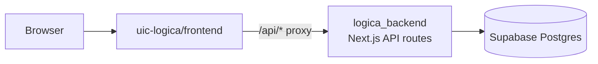
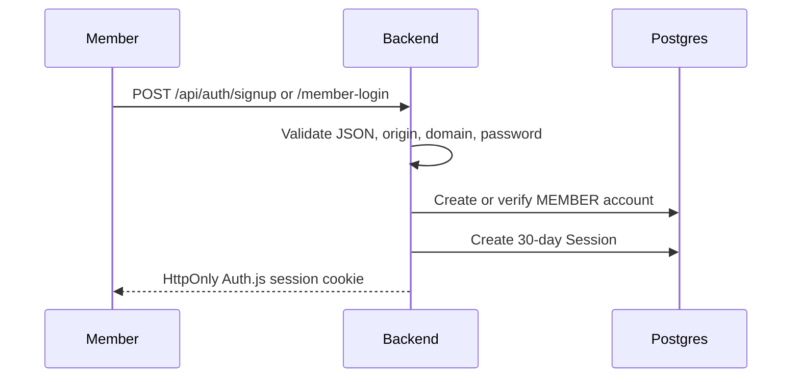
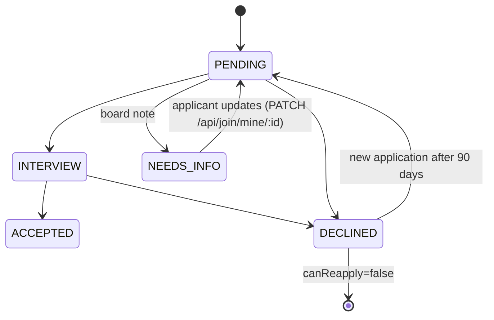
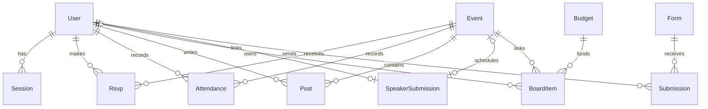
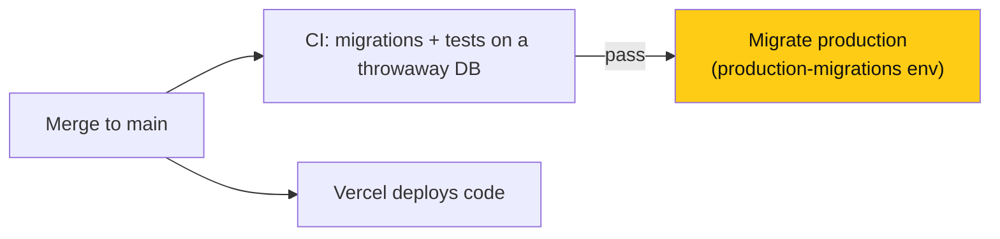

# LOGICA @ UIC backend

> **Owner:** [@nicolasrufino](https://github.com/nicolasrufino) · **Last reviewed:** Sep 29, 2026 · **Audience:** Members and recruiters · **Type:** Landing page

[](https://nextjs.org/) [](https://www.prisma.io/) [](https://supabase.com/) [](https://logica-backend.vercel.app)

This is the Next.js 16 App Router API for [LOGICA @ UIC](https://github.com/uic-logica), a University of Illinois Chicago student organization supporting Latinx and underrepresented students in computing. [Nicolas Rufino](https://github.com/nicolasrufino), software lead, owns every product, sets deadlines, and reviews and merges changes.

The repository is public for recruiters and the community to read. Contributions are limited to members of the `uic-logica` GitHub organization. Org-wide plans, contribution rules, and team pages live in the [organization `.github` repository](https://github.com/uic-logica/.github); do not duplicate them here.

Production runs on Vercel as `logica_backend` with Postgres on Supabase. The [frontend](https://github.com/uic-logica/frontend) proxies `/api/*` requests to this service.



## Authentication

Members can create an account with `POST /api/auth/signup` using an address allowed by `ALLOWED_EMAIL_DOMAIN`, then sign in through `POST /api/auth/member-login`. Password handlers create Auth.js database sessions manually in `lib/session.ts`; sessions last 30 days. The old passwordless implementation is archived in `archive/passwordless/` and is not active. See [AUTH.md](AUTH.md).



For local signup, `ALLOWED_EMAIL_DOMAIN` must be a real domain such as `uic.edu`; `*` matches nothing. `FRONTEND_URL` must exactly match the frontend origin because password endpoints enforce request origin.

## API access

| Area | Routes | Who can call |
| --- | --- | --- |
| Account access | `/api/auth/signup`, `/api/auth/member-login`, speaker login and invites | Public entry points; protected mutations require the relevant session |
| Events and participation | `/api/events`, `/api/attendance`, `/api/posts`, `/api/forms` | Public reads where supported; signed-in members for participation; BOARD/EXEC_BOARD for administration |
| Software Teams applications | `/api/join`, `/api/join/mine` | `SOFTWARE_ENGINEER` submission requires a signed-in `@uic.edu` member; BOARD/EXEC_BOARD reviews |
| Member workspace | `/api/dashboard`, profiles, notifications, MCP tokens | Signed-in account; responses are scoped to the caller |
| Exec workspace | `/api/board/*`, speaker review and scheduling | MEMBER account with EXEC_BOARD role; BOARD keeps the member workspace view |
| Public intake | `/api/speakers`, `/api/subscribe`, `/api/partner-inquiries` | Public submission; exec review |

Every application needs name, UIC email, major, grad year and a `why` of 40+ characters. Software Teams applications also need `github`, `hoursPerWeek`, ranked `TeamProject` values, `skills`, and a resume (`resumeUrl` or a PDF on the profile); they store the member `userId`. Board listings add `resumeOnFile` when the linked profile has a PDF resume.



`GET /api/join/mine` returns the caller's applications with the board's `reviewNote`. One open application per email and track; after a decline the board picks `canReapply`, and a new one is allowed 90 days after `decidedAt`. Current team labels are `team: site`, `team: opportunity-board`, `team: resume-builder`, `team: event-replays`, and `team: mock-interviewer`.

## Data model

`MembershipApplication.userId` is intentionally stored without a Prisma relation. This diagram shows only relations declared in `prisma/schema.prisma`.



`BoardItem` represents both MONEY and OUTREACH work. Reuse `lib/board-item.ts` for stage validation and budget rollups.

## Local development

Requirements: Node.js 24, npm, and the local Postgres container named `logica-local-pg` on port `5555`.

```bash
npm ci
cp .env.example .env
docker start logica-local-pg
npx prisma generate
npx prisma migrate deploy
npm run dev
```

Fill in `AUTH_SECRET`, `ALLOWED_EMAIL_DOMAIN`, and `FRONTEND_URL` in `.env`; never commit it. `npm run dev` serves the API on port 3001. Useful checks are `npm run lint`, `npm test`, `npx tsc --noEmit`, and `npm run build`.

## Production migrations

Automatic. When CI passes on `main`, [`migrate.yml`](.github/workflows/migrate.yml) runs `prisma migrate deploy` against production, one run at a time, for the exact commit CI tested. Vercel builds still only run `prisma generate && next build`.



- The database URL is the `DIRECT_URL` secret on the `production-migrations` GitHub environment (Supabase **session** pooler, port 5432). It lives nowhere else in the repo.
- Vercel and the migration run in parallel, so keep migrations **additive** (new nullable columns, new tables) and remove old columns in a later PR.
- Re-run or run on demand from **Actions → Migrate production → Run workflow**.

Manual fallback, only if Actions is down:

```bash
DATABASE_URL="$DIRECT_URL" npx prisma migrate status
DATABASE_URL="$DIRECT_URL" npx prisma migrate deploy
```

Here `DIRECT_URL` is a shell variable holding the session-pooler URL. Never put credentials or real hostnames in docs or commits.

## Deployment notes

- `FRONTEND_URL` is the exact frontend origin; the frontend's `NEXT_PUBLIC_API_URL` is this backend's origin.
- Google Drive access in `lib/drive.ts` is read-only. Missing Drive configuration produces an explicit empty state.
- `vercel.json` schedules event reminders. Set `CRON_SECRET` in deployed environments.
- CI generates Prisma, migrates a disposable Postgres database, checks the result matches `schema.prisma` (fails if a schema change has no migration), then runs lint, tests, TypeScript, and the production build.
